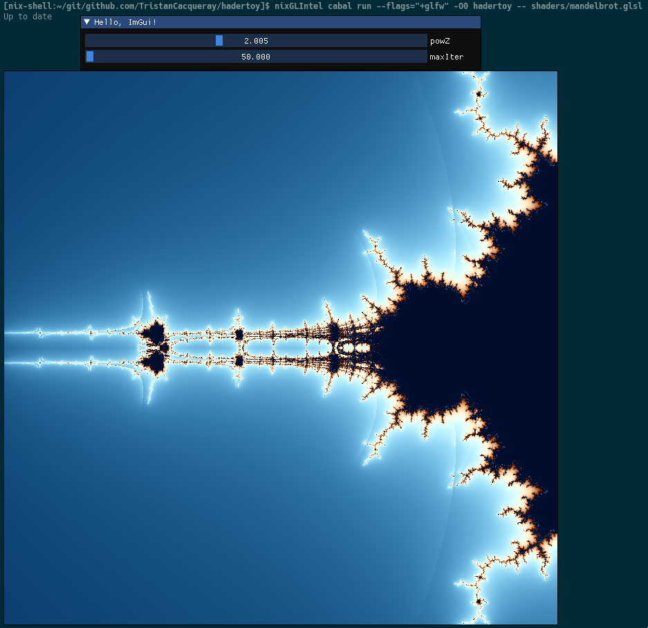

# hadertoy

The goal of hadertoy is to provide an Haskell library similar to [Glumpy](https://glumpy.github.io/)
to enable simple data visualisation.

See the [library header](src/Hadertoy.hs) and [example cli](app/Main.hs) for documentation.

## Usage

In its present form, hadertoy can be used to load a shader and update
the range and center uniform values using mouse scroll and click:

```shell
$ hadertoy ./shaders/mandelbrot.glsl
```

In map/julia mode, middle click on the map update the julia seed.

When an uniform is prefixed by `// dear-scale initial-value min-value max-value`,
a dear-imgui controller is created to adjust the value.



## Development

### Setup

Without nix, first install [dear-imgui.hs](https://github.com/haskell-game/dear-imgui.hs) with

```shell
$ cabal install --lib --flags="+glfw"
```

Then install the dependency with `cabal install`

Otherwise with nix, run `nix-shell`

### Build

```shell
$ cabal build && cabal test
```

Get documentation and hoogle service by running:

```shell
$ nix-shell --command "hoogle server -p 8080 --local --haskell"
```

When using nix, use [nixGL](https://github.com/guibou/nixGL) to run the
build, for example:

```shell
$ nixGLIntel cabal run hadertoy
```
